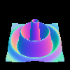
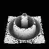
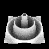

# Task06: Ambient Occlusion and BVH (Monte Carlo Integration, Importance Sampling)

**Deadline: May 30th (Thu) at 15:00pm**

----

## Before Doing Assignment

If you have not done the [task01](../task01), [task02](../task02) do it first to set up the C++ development environment.

Follow [this document](../doc/submit.md) to submit the assignment, In a nutshell, before doing the assignment,  
- make sure you synchronized the `main ` branch of your local repository  to that of remote repository.
- make sure you created branch `task06` from `main` branch.
- make sure you are currently in the `task06` branch (use `git branch -a` command).

Now you are ready to go!

---

## Problem 1 (compilation practice)

1. Build the code using cmake
2. Run the code **with release mode**

The program will output `normal_map.png` that update the image below

## Problem 2 (efficient search using BVH)

The code in Problem 1 is very slow. It is because the computation of intersection betweeen a ray and a triangle mesh is **brute force**. 

Comment out the brute force intersection computation (from `line#146` to `line#158`) and implement code to evaluate BVH to accelerate the computation around `line #120`.

The program output the computation time. Fill the table below to compare the timing before/after the acceleraion. Please make sure that you build the code **with release mode**

| brute force | BVH    |
| ----------- | ------ |
| 1508 ms      | 41 ms |

## Problem 3 (ambient occlusion)

Now you have the code for fast ray-mesh intersection. Using that code, let's compute the ambient occlusion.

- First, Comment out the `continue;`  in the `main()` at `line #21` in the original code . This will enable the ambient occlusion computation. The problem will output `ao.png`.

- Then fix the bug in `line #223`in the original code  to correctly compute the ambient occlusion. The result should looks like `preview.png` at the begining of this document.

- Finally, modify the name of the outut image as `ao_uniform.png`

## Problem 4 (importance sampling)

The computation of ambient occlusion is a bit noisy (i.e., the variance is high). Let's implement the importance sampling to reduce the variance. Write some code to compute the direction and PDF of **cosine-weighted sampling of hemisphere **around `line #53`.  Modify the name of the output image `ao.png`  as `ao_cosweight.png`.

| Uniform sample              | Cosine weighted sample        |
| --------------------------- | ----------------------------- |
|  |  |

Observe that the variance (noise) is reduced using the importance sampling

## After Doing the Assignment

After modify the code, push the code and submit a pull request. Make sure your pull request only contains the files you edited. Good luck!
